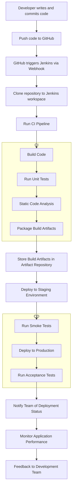

<!-- more -->
### **1. Code Commit in GitHub**

- **Developer Workflow**:
    - A developer writes code on a local machine.
    - Before committing, they might run local tests to ensure code quality.
    - The developer stages and commits changes to a **Git** repository.
    - The changes are then pushed to a **GitHub** repository, typically to a feature branch or directly to the main branch, depending on the workflow.

### **2. Triggering Jenkins Build**

- **Webhooks Setup**:
    - **GitHub Webhooks** are configured to notify Jenkins of new commits or pull requests.
    - Alternatively, Jenkins can be set up to poll the GitHub repository at regular intervals.
- **Build Trigger**:
    - Upon receiving a webhook notification, Jenkins triggers a job or pipeline associated with the repository.

### **3. Jenkins Pulls Code from GitHub**

- **Source Code Retrieval**:
    - Jenkins uses Git plugins to clone the repository or fetch the latest changes.
    - It checks out the specific branch or commit that triggered the build.

### **4. Continuous Integration Stage**

- **Compilation/Build**:
    - Jenkins executes build steps to compile the code.
        - For Java projects: uses **Maven** or **Gradle**.
        - For Node.js projects: runs **npm install** and **npm build**.
- **Automated Testing**:
    - **Unit Tests**:
        - Runs unit tests using frameworks like **JUnit**, **pytest**, or **Mocha**.
    - **Integration Tests**:
        - Tests interactions between different parts of the application.
    - **Code Analysis**:
        - Static code analysis using tools like **SonarQube** or **ESLint**.
        - Code coverage reports to measure test effectiveness.
- **Build Artifacts**:
    - Generates artifacts such as JAR files, Docker images, or binaries.
    - Stores artifacts in a repository (e.g., **Nexus**, **Artifactory**, or Docker Registry).

### **5. Continuous Deployment/Delivery Stage**

- **Deployment Preparation**:
    - Determines the deployment environment based on branch or tag (e.g., develop to staging, main to production).
    - Retrieves necessary credentials and configurations securely.
- **Automated Deployment**:
    - **For Containers**:
        - Builds a **Docker** image with the latest code.
        - Pushes the image to a **Docker Registry**.
        - Deploys to **Kubernetes** or another container orchestration platform.
    - **For Traditional Servers**:
        - Copies build artifacts to servers via **SSH**, **FTP**, or through cloud services.
        - Executes deployment scripts to install and start the application.
- **Database Migrations** (if applicable):
    - Runs database migration tools like **Flyway** or **Liquibase** to update the database schema.

### **6. Post-Deployment Testing**

- **Smoke Tests**:
    - Quick tests to ensure basic functionality works in the deployed environment.
- **Acceptance Tests**:
    - Runs automated end-to-end tests to validate the application's functionality.

### **7. Notifications and Reporting**

- **Build Status Updates**:
    - Jenkins updates the build status on GitHub (e.g., passing or failing checks).
- **Notifications**:
    - Sends notifications via email, Slack, or other messaging platforms about build and deployment results.
- **Reporting**:
    - Generates reports for test results, code coverage, and code quality metrics.

### **8. Monitoring and Feedback**

- **Monitoring Tools**:
    - Application logs and metrics are collected using tools like **ELK Stack** (Elasticsearch, Logstash, Kibana) or **Prometheus** and **Grafana**.
- **Feedback Loop**:
    - Issues detected in production are fed back to the development team.
    - Continuous improvement of the CI/CD pipeline based on feedback.

### **9. Merge and Release Management**

- **Pull Requests and Code Reviews**:
    - Developers create pull requests in GitHub.
    - Team members review code changes before merging to the main branch.
    - Jenkins can be set up to automatically run tests on pull requests and report back to GitHub.
- **Release Tagging**:
    - Upon successful deployment, GitHub is updated with release tags.
    - Release notes may be generated automatically.

### **10. Rollback Mechanisms**

- **Failure Handling**:
    - If deployment fails or issues are detected, Jenkins can trigger rollback procedures.
    - Previous stable versions can be redeployed from stored artifacts.

---

### **Key Components and Tools**

- **Jenkins Pipeline**:
    - Uses **Declarative** or **Scripted Pipelines** written in Jenkinsfile, stored in the GitHub repository.
    - Defines stages (e.g., Build, Test, Deploy) and steps within each stage.
- **Credentials Management**:
    - Sensitive information (e.g., passwords, API keys) is securely stored in Jenkins using **Credentials Plugin**.
    - Credentials are injected into the pipeline as needed.
- **Parallel Execution**:
    - Tests and build steps can be run in parallel to speed up the pipeline.
- **Environment Management**:
    - Uses **Jenkins agents** (nodes) to run builds in different environments (e.g., Linux, Windows).
    - Docker agents can be used for consistent build environments.

### **Example Jenkinsfile**

Here's a simplified example of a Jenkinsfile for a Node.js application:

```groovy
pipeline {
    agent any
    stages {
        stage('Checkout') {
            steps {
                git 'https://github.com/username/repository.git'
            }
        }
        stage('Install Dependencies') {
            steps {
                sh 'npm install'
            }
        }
        stage('Run Tests') {
            steps {
                sh 'npm test'
            }
            post {
                always {
                    junit 'test-results.xml'
                }
            }
        }
        stage('Build') {
            steps {
                sh 'npm run build'
            }
        }
        stage('Docker Build and Push') {
            steps {
                script {
                    dockerImage = docker.build("username/repository:${env.BUILD_NUMBER}")
                    docker.withRegistry('https://registry.hub.docker.com', 'dockerhub-credentials') {
                        dockerImage.push()
                    }
                }
            }
        }
        stage('Deploy to Kubernetes') {
            steps {
                withKubeConfig([credentialsId: 'kubeconfig-credentials']) {
                    sh 'kubectl set image deployment/my-app my-app=username/repository:${env.BUILD_NUMBER}'
                }
            }
        }
    }
    post {
        success {
            echo 'Build and deployment succeeded!'
        }
        failure {
            echo 'Build or deployment failed.'
        }
    }
}

```

### **Summary**

- **Continuous Integration**:
    - Ensures that code changes are integrated frequently and verified by automated builds and tests.
- **Continuous Deployment**:
    - Automates the release of code to production, allowing for rapid and reliable deployments.
- **Automation and Collaboration**:
    - Jenkins automates the CI/CD pipeline.
    - GitHub facilitates collaboration through version control, code reviews, and issue tracking.

---

By implementing this CI/CD process with Jenkins and GitHub, development teams can:

- **Reduce Integration Problems**: Frequent integration helps identify conflicts and issues early.
- **Improve Code Quality**: Automated testing and code analysis enforce quality standards.
- **Accelerate Deployment**: Automation reduces manual effort and speeds up the release cycle.
- **Enhance Collaboration**: Clear processes and feedback loops improve team communication.