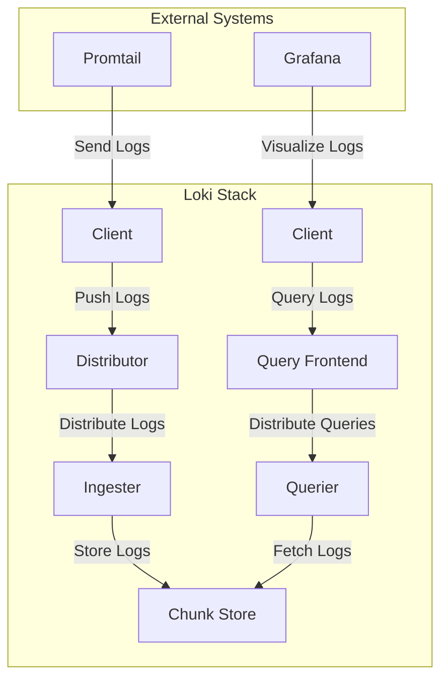
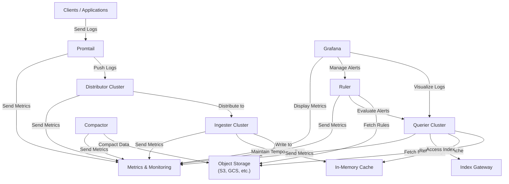

## **Components Description**

- **Distributor**: Receives log data from clients and distributes it to the ingesters.
- **Ingester**: Processes and stores log data temporarily before it is flushed to the chunk store.
- **Chunk Store**: A long-term storage solution for log data, such as an object store (e.g., S3, GCS).
- **Querier**: Fetches log data from the chunk store to respond to user queries.
- **Query Frontend**: Distributes incoming queries to multiple queriers for load balancing and parallel processing.
- **Promtail**: A log collection agent that sends logs to the Loki distributor.

## **Interaction Flow**

1. **Log Ingestion**:
    - Logs are sent from the **Client** to the **Distributor**.
    - The **Distributor** distributes the logs to multiple **Ingesters**.
    - **Ingesters** process and temporarily store the logs before flushing them to the **Chunk Store**.
2. **Log Storage**:
    - **Ingesters** periodically flush processed logs to the **Chunk Store** for long-term storage.
3. **Log Querying**:
    - **Clients** (e.g., Grafana) send queries to the **Query Frontend**.
    - The **Query Frontend** distributes the queries to multiple **Queriers**.
    - **Queriers** fetch the required log data from the **Chunk Store** and return it to the **Client**.

## Optimization Actions for High-Concurrency Log Processing and Storage Scalability

### 1. **Horizontal Scaling of Log Collection: Promtail**

- **Action**: Increase the number of Promtail instances to handle the load of log collection in a high-concurrency environment. Promtail is Loki's log collection agent, responsible for gathering logs from various nodes.
- **Implementation**:
    - In a Kubernetes cluster, configure Promtail as a DaemonSet to ensure an instance runs on each node, enabling automatic scaling across all nodes for comprehensive log collection.
    - When workload increases in the cluster, dynamically adjust the number of Promtail instances to prevent log collection from becoming a bottleneck. Use Kubernetes Horizontal Pod Autoscaling (HPA) to scale Promtail instances up or down based on log collection load.
- **Key Technology**: Utilize Kubernetes load balancing to evenly distribute logs from different nodes to Promtail instances, in combination with HPA for dynamic scaling.

### 2. **Sharding and Partitioning Strategy for Loki Storage Layer**

- **Action**: To address storage bottlenecks, implement sharding and partitioning strategies at the Loki storage layer, distributing logs across multiple storage nodes to enhance write throughput.
- **Implementation**:
    - Configure the storage layer (e.g., using S3 or MinIO) in Loki for distributed storage, using sharding and partitioning to spread logs across various storage nodes. Each node handles only part of the data, reducing write pressure on individual nodes.
    - Specify multiple storage targets in Loki's configuration, allowing horizontal scaling across multiple physical or virtual storage nodes to improve fault tolerance and storage performance.

### 3. **Parallel Processing: Ingester**

- **Action**: The Ingester component in Loki is responsible for receiving and processing log data. In high-concurrency environments, increase the number of Ingester instances to enable parallel log processing.
- **Implementation**:
    - Increase the number of Ingester instances, with each instance handling a portion of the log data. By introducing sharding, each Ingester processes only part of the log stream, avoiding overload on individual instances.
    - Deploy Loki using Kubernetes StatefulSets and leverage Loki's replication and consistency model to ensure log data processing continuity even if some Ingester nodes fail.

### 4. **Monitoring and Dynamic Adjustment: Prometheus Monitoring and Scaling Strategy**

- **Action**: To ensure dynamic adjustment capabilities, design a real-time monitoring and auto-scaling strategy based on Prometheus.
- **Implementation**:
    - Use Prometheus to monitor load metrics for each component of the Loki Stack (e.g., Promtail, Ingester, Querier), including log collection throughput and storage latency.
    - Based on monitored metrics, dynamically adjust the number of Promtail and Ingester instances, scaling up during peak periods and scaling down during lower loads to save costs.
- [Monitoring metrics](https://shaorui0.github.io/2024/10/29/monitoring_loki/)