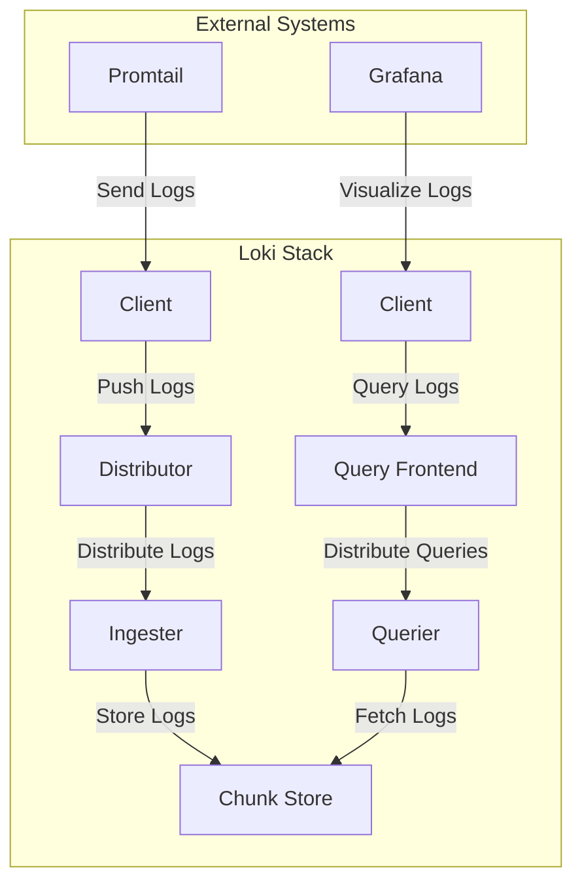

## **Components Description**

- **Client**: The source of log data, which can be applications, services, or other logging agents.
- **Distributor**: Receives log data from clients and distributes it to the ingesters.
- **Ingester**: Processes and stores log data temporarily before it is flushed to the chunk store.
- **Chunk Store**: A long-term storage solution for log data, such as an object store (e.g., S3, GCS).
- **Querier**: Fetches log data from the chunk store to respond to user queries.
- **Query Frontend**: Distributes incoming queries to multiple queriers for load balancing and parallel processing.
- **Promtail**: A log collection agent that sends logs to the Loki distributor.
- **Grafana**: A visualization tool that queries Loki for log data and displays it in dashboards.

## **Interaction Flow**

1. **Log Ingestion**:
    - Logs are sent from the **Client** to the **Distributor**.
    - The **Distributor** distributes the logs to multiple **Ingesters**.
    - **Ingesters** process and temporarily store the logs before flushing them to the **Chunk Store**.
2. **Log Storage**:
    - **Ingesters** periodically flush processed logs to the **Chunk Store** for long-term storage.
3. **Log Querying**:
    - **Clients** (e.g., Grafana) send queries to the **Query Frontend**.
    - The **Query Frontend** distributes the queries to multiple **Queriers**.
    - **Queriers** fetch the required log data from the **Chunk Store** and return it to the **Client**.
4. **Visualization**:
    - **Grafana** queries Loki for log data and visualizes it in dashboards.