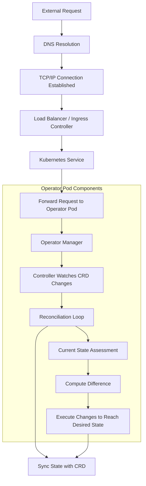

how does the outside (cluster) network request access the k8s operator and final the operator handle the process? answer the process in low level, suck as tcp/ip, k8s service mechanism, CRD, operator reconcile, manager and controller in operator, etc

To understand how an external network request reaches a Kubernetes (k8s) operator and how the operator processes it, we need to dissect the journey step by step, focusing on the underlying mechanisms like TCP/IP, Kubernetes services, Custom Resource Definitions (CRDs), and the internal workings of an operator, including the reconcile loop, managers, and controllers.

<!-- more -->
### **1. External Request to Kubernetes Cluster**

When an external request targets a Kubernetes cluster, it usually hits a **Load Balancer** or an **Ingress Controller** first. The Load Balancer operates at Layer 4 (L4) of the OSI model, dealing with IP addresses and ports, while an Ingress Controller operates at Layer 7 (L7), dealing with HTTP routes.

- **DNS Resolution**: The external DNS name, associated with the service, resolves to the IP address of the Load Balancer or the Ingress Controller.
- **TCP/IP Connection**: A TCP connection is established between the client and the Load Balancer or Ingress, adhering to the TCP/IP model, which involves SYN, SYN-ACK, and ACK packets to establish a connection.

### **2. Routing to the Kubernetes Service**

After the initial connection, the request is routed to the appropriate Kubernetes Service.

- **Kubernetes Service**: A Kubernetes Service is a REST object in Kubernetes that describes how to access applications, such as the operator's API, inside the cluster. It acts as an internal load balancer. There are different types of Services (e.g., ClusterIP, NodePort(limitation, port 数量有限), LoadBalancer), but typically, for external access, a LoadBalancer or NodePort service in conjunction with Ingress is used.

### **3. Accessing the Operator**

The Kubernetes Service forwards the request to the **correct pod(s) where the operator is running.** Operators are implemented as a set of pods within the Kubernetes cluster, often deployed and managed via a Deployment.

- **TCP Connection to Pod**: Inside the cluster, Kubernetes maintains its **internal networking**, ensuring the service request is forwarded to the **correct pod IP** address, maintaining the TCP connection from the external request.

### **4. Operator Components and CRD**

Operators are built on the controller pattern. They watch specific resources in the Kubernetes API, reacting to creation, modification, or deletion of those resources. The core components involved are:

- **Custom Resource Definitions (CRDs)**: Operators extend Kubernetes API with CRDs. A CRD allows you to define a Custom Resource (CR), which is a piece of the desired state that the operator manages.
- **Manager**: This component is responsible for **registering the operator's controllers** and setting up their **event handlers**. It starts the controller processes.
- **Controller**: **Each controller watches for changes** to its specific CRD. It aims to make the current state of the CR match the desired state described by the CR.

### **5. Reconciliation Loop**

When a controller notices a change to a CRD it manages (or related resources), it triggers the **reconciliation loop**. The reconcile function:

- **Reads the current state**: It assesses the current state of the cluster concerning the desired state described by the CRD.
- **Compute the difference**: Determines what action(s) must be taken to reach the desired state.
- **Execute Changes**: Performs the necessary Kubernetes API calls to bring the current state in line with the desired state. This could involve creating, updating, or deleting Kubernetes resources.

### **Conclusion**

The process starts with a TCP/IP connection from an external network that is routed through a Load Balancer or Ingress to a Kubernetes Service. This service then forwards the request to an operator pod. The operator, through its controller components, watches for CRD changes to trigger a reconciliation loop, ensuring the cluster's state matches the desired state described in CRDs. This involves a deep integration of networking protocols, Kubernetes service mechanisms, and the operator's internal logic for managing resources.
