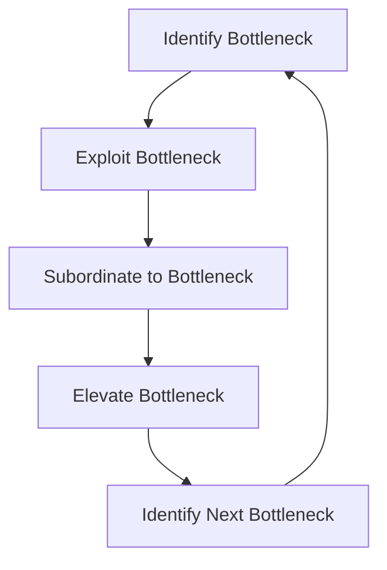

<!-- # Comprehensive Task Management and Prioritization Methodologies -->

Effective task management and prioritization are crucial for maximizing productivity and achieving goals. This methodology integrates several proven techniques, each offering unique strategies to organize and prioritize tasks. Below is an enhanced overview of each method, supplemented with visual aids for clarity.

---

## 1. The Important-Urgent Matrix (Four Quadrants)

The **Important-Urgent Matrix** helps in categorizing tasks based on their urgency and importance, enabling better prioritization.

|                  | **Urgent**                          | **Not Urgent**                  |
|------------------|-------------------------------------|---------------------------------|
| **Important**    | **Quadrant I: Do First**            | **Quadrant II: Schedule**       |
| **Not Important**| **Quadrant III: Delegate**          | **Quadrant IV: Eliminate**      |

### Quadrant Descriptions
- **Quadrant I: Do First**  
  Tasks that are both important and urgent. These require immediate attention.
  
- **Quadrant II: Schedule**  
  Tasks that are important but not urgent. Plan and allocate time to address these to prevent them from becoming urgent.
  
- **Quadrant III: Delegate**  
  Tasks that are urgent but not important. Delegate these tasks to others if possible.
  
- **Quadrant IV: Eliminate**  
  Tasks that are neither urgent nor important. These should be minimized or eliminated.

---

## 2. Ivy Lee Method

A simple yet highly effective technique for daily task management.

1. **List Six Tasks:** Every night, write down the six most important tasks to accomplish the next day.
2. **Prioritize:** Arrange them in order of importance.
3. **Execute Sequentially:** Tackle them one by one in the prioritized order.
4. **Carry Over:** Any unfinished tasks are moved to the next day and reassessed.

---

## 3. MoSCoW Method

A prioritization framework used to decide which tasks to focus on.

| **Category**    | **Description**                                                      |
|-----------------|----------------------------------------------------------------------|
| **Must-haves**  | Essential tasks that are critical for success.                      |
| **Should-haves**| Important tasks that are not critical but add significant value.      |
| **Could-haves** | Desirable tasks that can enhance outcomes but are not necessary.     |
| **Won't-haves** | Tasks that are agreed upon to be excluded from the current scope.     |

---

## 4. RICE Method

A scoring system to prioritize tasks based on multiple factors.

| **Factor**      | **Description**                                                      |
|-----------------|----------------------------------------------------------------------|
| **Reach**       | Number of people or tasks affected by the initiative.               |
| **Impact**      | The potential effect on the overall goal or outcome.                |
| **Confidence**  | The level of certainty in the estimates of reach, impact, and effort.|
| **Effort**      | The amount of resources required to complete the task.              |

### RICE Score Calculation
\[ \text{RICE Score} = \frac{\text{Reach} \times \text{Impact} \times \text{Confidence}}{\text{Effort}} \]

**Higher RICE scores** indicate higher priority tasks.

---

## 5. ABCDE Method

A categorization system to prioritize tasks based on their consequences.

| **Category** | **Description**                                                                 |
|--------------|---------------------------------------------------------------------------------|
| **A**        | Must be done today; serious consequences if not completed.                     |
| **B**        | Should be done today; some consequences if not completed.                      |
| **C**        | Nice to do; no consequences if not completed.                                  |
| **D**        | Delegate to others.                                                            |
| **E**        | Eliminate; unnecessary tasks.                                                  |

---

## 6. Buffett's 5/25 Rule

A strategy to maintain focus on top priorities by limiting distractions.

1. **List 25 Goals:** Write down the 25 most important goals you want to achieve.
2. **Prioritize:** Select the top 5 goals that are most critical.
3. **Focus:** Concentrate solely on achieving these top 5 goals.
4. **Avoid:** Do not work on the remaining 20 goals until the top 5 are accomplished.
5. **Repeat:** After completing the top 5, reassess and set new priorities.

---

## 7. Khe Hy's $10,000/h Rule

A framework for allocating time based on the leverage of tasks.

| **Leverage Level** | **Description**                                                   | **Examples**                                 |
|--------------------|-------------------------------------------------------------------|----------------------------------------------|
| **$10,000/h**      | High-tech, high-leverage work with varied paths.                  | Strategic planning, innovation projects      |
| **$1,000/h**       | High-tech, low-leverage work.                                     | Professional services (lawyers, doctors)     |
| **$100/h**         | Low-tech, high-leverage work.                                     | Scriptwriting, side hustles                   |
| **$10/h**          | Low-tech, low-leverage work.                                      | Manual labor                                 |

**Strategy:** Allocate more time to higher leverage activities to maximize productivity and impact.

---

## 8. Goldratt's Theory of Constraints

A method to identify and eliminate bottlenecks in processes.

### Steps to Resolve Constraints

1. **Identify Bottleneck:** Determine the part of the system that limits overall performance.
2. **Exploit Bottleneck:** Make the most of the existing capacity without significant investment.
3. **Subordinate Everything Else:** Align all other processes to support the bottleneck's maximum efficiency.
4. **Elevate Bottleneck:** Increase the capacity of the bottleneck through additional resources or process improvements.
5. **Repeat:** Once the current bottleneck is resolved, identify the next one and continue the process.

### Pipeline Diagram

## Summary

By integrating these methodologies, you can create a robust system for task management and prioritization. Here's a quick reference table to compare the different methods:

| **Method** | **Focus** | **Best For** |
| --- | --- | --- |
| **Important-Urgent Matrix** | Urgency and Importance | Quick prioritization of tasks |
| **Ivy Lee Method** | Daily Task Management | Individuals seeking a simple daily routine |
| **MoSCoW Method** | Task Categorization | Project management and requirement prioritization |
| **RICE Method** | Multi-factor Task Scoring | Product management and feature prioritization |
| **ABCDE Method** | Consequence-based Prioritization | Personal productivity and daily planning |
| **Buffett's 5/25 Rule** | Focus on Top Priorities | Long-term goal setting and focus enhancement |
| **$10,000/h Rule** | Time Allocation Based on Leverage | Entrepreneurs and professionals optimizing time |
| **Theory of Constraints** | System Bottleneck Identification | Process optimization and efficiency improvement |

Utilizing a combination of these methods can help tailor your approach to task management, ensuring both immediate and long-term objectives are met efficiently.