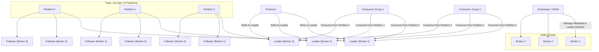

```mermaid
graph TB
    subgraph "Kafka Cluster"
        Broker1["Broker 1"]
        Broker2["Broker 2"]
        Broker3["Broker 3"]
    end

    subgraph "Topic: my-topic (3 Partitions)"
        P0["Partition 0"]
        P1["Partition 1"]
        P2["Partition 2"]
    end

    P0 --> LeaderP0["Leader (Broker 1)"]
    P0 --> FollowerP0_B2["Follower (Broker 2)"]
    P0 --> FollowerP0_B3["Follower (Broker 3)"]

    P1 --> LeaderP1["Leader (Broker 2)"]
    P1 --> FollowerP1_B3["Follower (Broker 3)"]
    P1 --> FollowerP1_B1["Follower (Broker 1)"]

    P2 --> LeaderP2["Leader (Broker 3)"]
    P2 --> FollowerP2_B1["Follower (Broker 1)"]
    P2 --> FollowerP2_B2["Follower (Broker 2)"]

    Producer["Producer"] -->|Write to Leader| LeaderP0
    Producer -->|Write to Leader| LeaderP1
    Producer -->|Write to Leader| LeaderP2

    ConsumerGroup1["Consumer Group 1"] -->|Consume from Partition 0| LeaderP0
    ConsumerGroup1 -->|Consume from Partition 1| LeaderP1
    ConsumerGroup1 -->|Consume from Partition 2| LeaderP2

    ConsumerGroup2["Consumer Group 2"] -->|Consume from Partition 0| LeaderP0
    ConsumerGroup2 -->|Consume from Partition 1| LeaderP1
    ConsumerGroup2 -->|Consume from Partition 2| LeaderP2

    Zookeeper["ZooKeeper / KRaft"] -->|Manage Metadata & Leader Election| Broker1
    Zookeeper --> Broker2
    Zookeeper --> Broker3

```